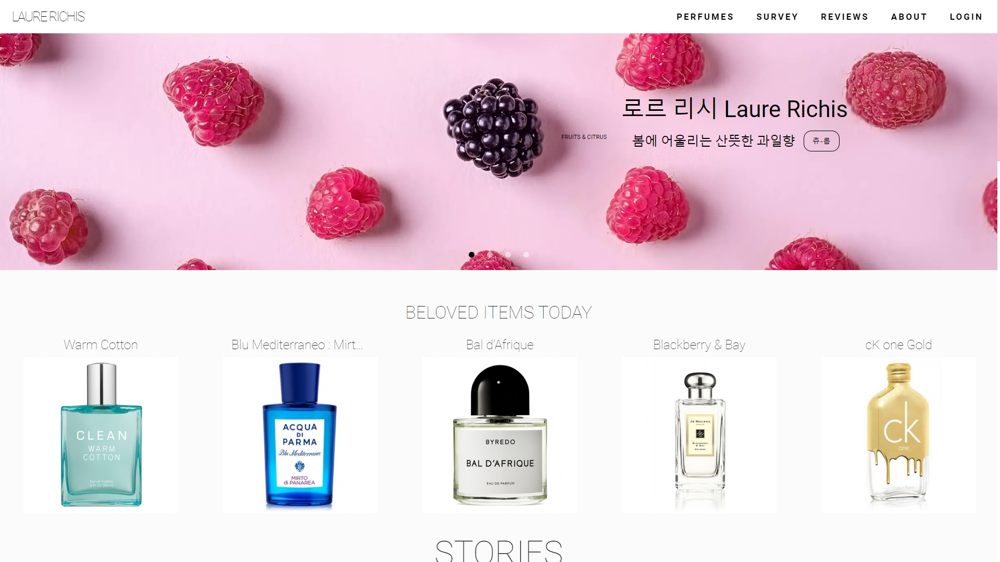
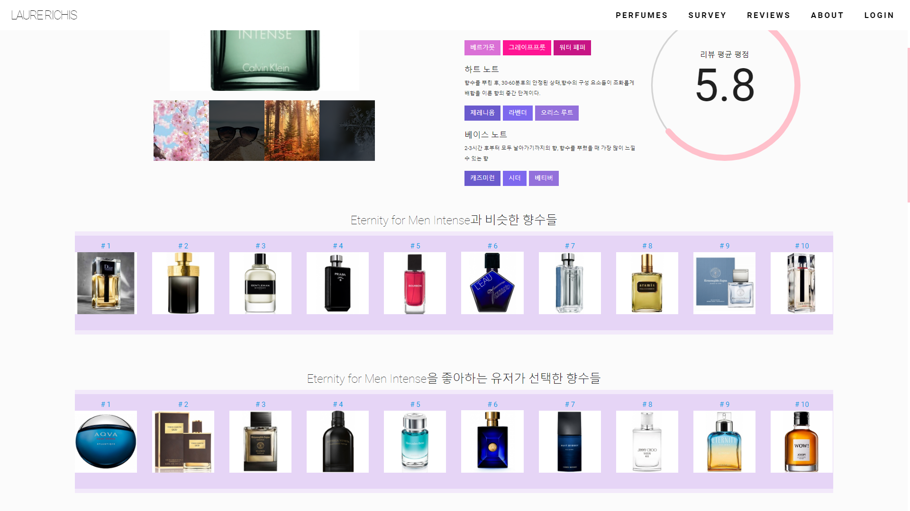
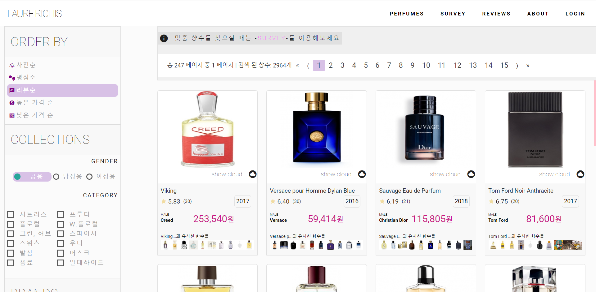
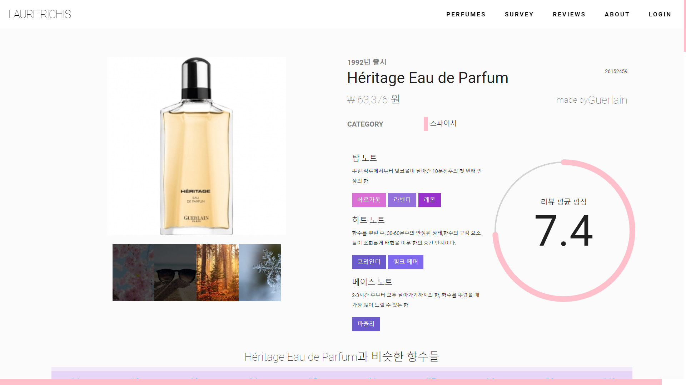
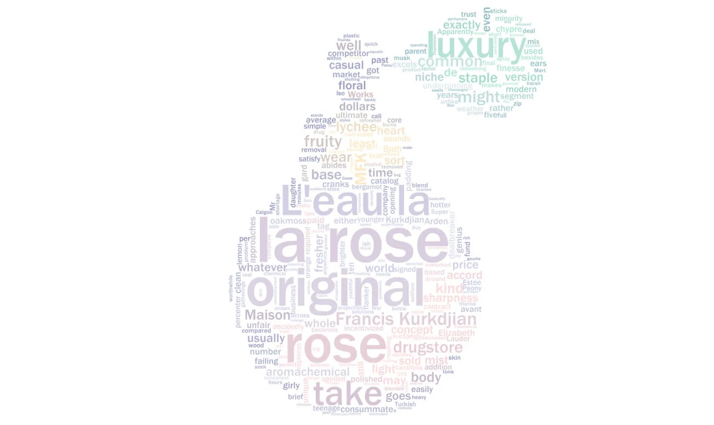
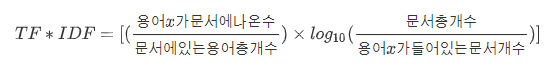
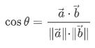
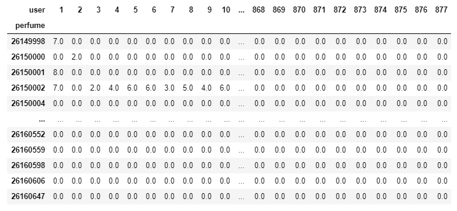
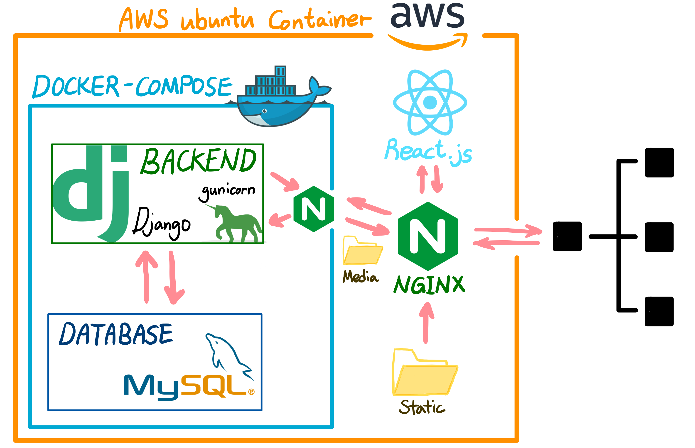

# :wilted_flower: 향수 추천 프로젝트[Laure Richis]

[팀 노션 바로가기](https://www.notion.so/e89e794cf439444994ab31f82d06f37a) 

### 목차

<hr>

[1. 서비스 소개](#1.-서비스-소개)

[2. 기술스택](#2.-기술스택)

[3. 데이터 분석 과정](#3.-데이터-분석-과정)

[4. 아키텍처 상세](#4.-아키텍처-상세)

[5. 레이아웃 및 디자인](#5.-레이아웃-및-디자인)

<hr>

## 1. 서비스 소개

> 빅데이터 기반 개인 맞춤 향수 추천 서비스

고객이 원하는 향수를 쉽게 찾고, 자신의 취향에 맞는 향수를 추천받을 수 있도록 하여 구매에 도움을 주는 웹 서비스입니다.



### 1.1. 타겟 고객군

* **귀차니스트 향알못**

  향수를 한 번도 사본 적이 없지만 일상 생활 속의 향은 잘 기억하며, 향을 직접 맡으러 오프라인 매장에 가기엔 귀찮은 고객

* **귀차니스트**

  향수를 몇 개 사본 적이 있으며 새로운 향수를 사고 싶지만, 직접 오프라인 매장에 가기엔 귀찮은 고객

### 1.2. 주요 기능

#### 1.2.1. 맞춤 향수 추천

1. TF-IDF로 각 향수에 대한 리뷰 내용를 분석(Content-based Recommendation)하여 비슷한 향수를 추천합니다.
2. 사용자가 향수에 남긴 평점을 바탕으로 SVD를 이용하여 Item-based and User-based Recommendation로 사용자가 좋아할 만한 향수를 추천합니다.



#### 1.2.2. 향수 상세 정보 제공

1. **40,000개**의 향수 상세 정보를 열람할 수 있습니다.





2. 리뷰를 분석하여 해당 향수의 향기를 직접 맡지 않아도 한 눈에 알 수 있도록 워드클라우드를 제공합니다.




## 2. 기술 스택

### 2.1. 데이터 수집 및 처리

> Raw 데이터를 가공해서 의미있는 자료로 만들고, 정규화하여 DB에 저장합니다.

* Python 3.6.8

* Pandas

* Matplotlib

* Numpy

### 2.2. 백엔드

* Python 3.6.8

* Django

  

  > 파이썬으로 만들어진 무료 오픈소스 웹 애플리케이션 프레임워크(web application framework)입니다.

  1. 라우팅, 직렬화, 테스트, 관리자 페이지 등 기능 지원이 다양하고 풍부하다.
  2. Python이다.(Python의 다양한 데이터 분석 라이브러리 사용 가능)

* DRF(Django Rest Framework)

  > DB의 데이터를 조회하고 유의미한 모음으로 직렬화하여, 클라이언트와 통신하는 API서버를 작성합니다.

  

* Swagger

  

  1. 사실상 표준

* JWT

  > JSON Web Token (JWT) is an open standard (RFC 7519) that defines a compact and self-contained way for securely transmitting information between parties as a JSON object.

  

  1. JWT를 발급한 후 토큰 검증만 하면 되기 때문에 추가 저장소가 필요 없다.
  2. 토큰 기반으로 하는 다른 인증 시스템에 접근이 가능하다.
     * Facebook 로그인, Google 로그인 등은 모두 토큰을 기반으로 인증하기 때문에 선택적으로 이름이나 이메일 등을 받을 수 있다.

* MySQL

### 2.3. 프론트엔드

* Typescript

  

  1. 타입스크립트는 자바스크립트의 수퍼셋으로, 코드의 가독성과 생산성을 높여줍니다.
  2. 라이브러리 등에서 직접 지원하는 경우가 많습니다.
  3. 산업군에서 많이 채택하고 있는 환경입니다.

* React.js

  

  1. Vue와 함께 최고 점유율 라이브러리
  2. 강력한 상태관리와 타입스크립트 친화적 환경

* Redux

* Materialize

  

  1. 컴포넌트 단순함
  2. css 전처리기가 없어서 커스터마이징 자유도 높음

### 2.4. 배포

* AWS EC2
* Docker
* Nginx

### 2.4. 프로젝트 관리

* Git
* Notion
* Jira

## 3. 데이터 수집 및 분석 과정

### 3.1. Content-based Recommendation - TF-IDF

- TF-IDF는 용어빈도-역문서빈도를 의미합니다.
- 각 향수들이 가진 리뷰를 기반으로 다른 향수들과의 유사성을 측정합니다.



- 위의 식을 구현하기 위해 `scikit-learn`의 tfidfvectorizer API를 사용하였습니다.

```python
tfidf = TfidfVectorizer(analyzer='word', ngram_range=(1, 2), min_df = 1, stop_words='english')
tfidf_matrix = tf.fit_transform(reviews['content'])
```

- 영어의 불용어(stop-words)를 제거했고, ngram_range를 1에서 2까지로 정의하였습니다.
- 한 향수의 리뷰가 다른 품과 얼마나 유사한지를 확인하기 위해 코사인 유사도 행렬을 구축하였습니다. 이를 위해 TF-IDF 간 벡터간의 점곱을 구합니다.



```python
cosine_similarities = linear_kernel(tfidf_matrix, tfidf_matrix)
```

- 코사인유사도가 1에 가까울 수록 비슷한 품목임을 나타내므로, 하나의 향수가 입력이 되었을 때 코사인유사도가 큰 순서대로 비슷한 향수를 추천합니다.
- 해당 향수 추천서비스에는 리뷰가 들어있는 향수에 한해서 최대 10개의 비슷한 향수가 저장되어 있습니다.

### 3.2. 행렬 인수분해를 활용한 추천알고리즘 - Matrix Factorization

* 협업필터링을 잠재 요인 모델을 활용해 구현합니다.
* 행렬 인수분해 방법은 모든 항목에 독립적인 고유한 표현식을 갖고 있다고 가정하여 가중치가 적용된 각 속성에 대한 사용자의 강도를 합산하여 근사값(잠재 요인)을 구하는 방식입니다.
* 해당 향수 추천 서비스에서는 향수의 리뷰와 평점을 기반으로 사용자에게 향수를 추천하거나 서비스를 제공합니다.
* 여러 SVD 중 행렬의 대각원소(특이값) 중 상위 t개만 골라내는 truncated SVD를 사용하였습니다.
* 행이 향수의 고유Id, 열이 User인 피봇테이블을 생성합니다.



- 차원축소를 위해 scikit learn의 TruncatedSVD API를 사용합니다. 차원을 12차원으로 축소시켰습니다.

```python
SVD = TruncatedSVD(n_components=12)
SVD_matrix = SVD.fit_transform(review_pivot)
```

- 차원이 축소된 행렬로 모든  쌍에 대한 피어슨 상관계수를 계산합니다.

```python
corr = np.corrcoef(SVD_matrix)
```

- 한 향수의 값이 입력이 되면 상관점수가 0.9 이상 1 미만인 향수 10개가 추천이 됩니다.
- 해당 향수 추천서비스에는 리뷰가 들어있는 향수에 한해서 최대 10개의 추천 향수가 저장되어 있습니다.

다음은 [Basenotes.net](http://www.basenotes.net/)에서 크롤링한 데이터 예시입니다.

```json
// 향수 데이터 예시
{
    "pk": 26120000,
    "model": "perfumes.perfume",
    "fields": {
        "name": "Ambre Canelle",
        "launch_date": "1949-01-01",
        "thumbnail": "http://www.basenotes.net/photos/products/st/26120000.jpg",
        "gender": 0,
        "top_notes": [224, 480],
        "heart_notes": [224, 259, 510, 785],
        "base_notes": [28, 624],
        "seasons": [3, 4],
        "availability": false,
        "brand": 749,
        "categories": [3, 6],
        "price": 169.99
    }
}
```

```json
// 노트 데이터 예시
{
    "pk": 1,
    "model": "perfumes.note",
    "fields": {
        "name": "absinthe",
        "kor_name": "압생트"
    }
}
```

```json
// 리뷰 데이터 예시
{
    "pk": 1,
    "model": "perfumes.review",
    "fields": {
        "content": "This is a grown-up powdery perfume.  Very feminine.  The powdery vibe changes mood as it mellows on the skin.  In the middle there is a smoky-musky, almost bitter vanilla.  Towards the \"end\" a heliotropic floral with a tangy citrus accord.  Sweet Dreams is a good name for this.  It describes it well.\n\r\nLongevity is outstanding.  Sillage is better than moderate.",
        "rate": 7,
        "created_at": "2017-09-02 00:00:00",
        "user": 1,
        "perfume": 26149998
    }
}
```

## 4. 아키텍처 상세



## 5. 레이아웃 및 디자인


## 6. 팀 소개


* **팀장** 이경호 : 프론트엔드 / PM / 백엔드
* 팀원 양혜진 : 백엔드
* 팀원 박홍은 : 데이터분석 / 백엔드
* 팀원 이해인 : 디자인 / 프론트엔드
* 팀원 남승현 : 데이터분석